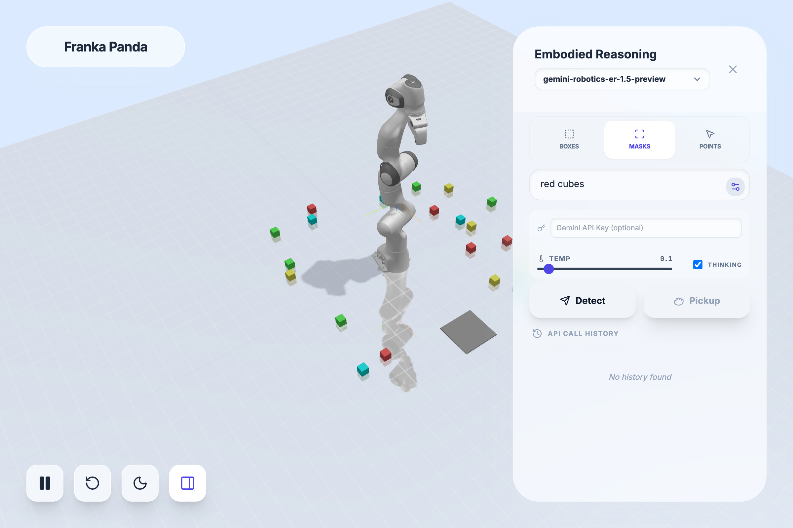
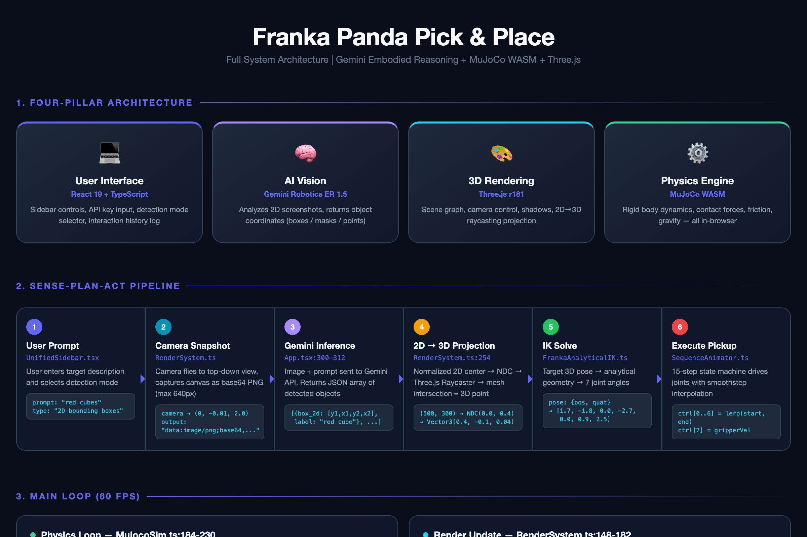
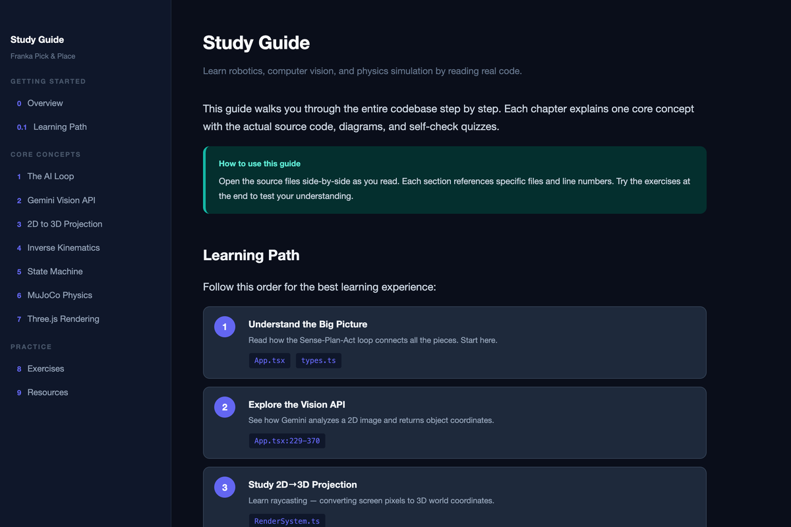

# Gemini Robotics ER Playground

[](LICENSE) [](https://robotics-pick-and-place.vercel.app) [](https://deepmind.google/technologies/gemini/robotics/)

A browser-based playground for testing **Google Gemini Robotics Embodied Reasoning** — the AI model purpose-built for robotic manipulation. Run a full Sense-Plan-Act loop where Gemini ER analyzes a 3D scene and directs a 7-DOF Franka Panda arm to pick up objects, all in real-time physics simulation.

Instead of toy demos or static API calls, this puts Gemini's robotics model through an actual **perception-to-manipulation pipeline** — entirely in the browser, no robot hardware needed.

<p align="center">
  <a href="https://robotics-pick-and-place.vercel.app">
    
  </a>
</p>

<p align="center">
  <b><a href="https://robotics-pick-and-place.vercel.app">Try it online</a></b> · <b><a href="https://robotics-pick-and-place.pages.dev">Mirror</a></b> · Bring your own <a href="https://aistudio.google.com/apikey">Gemini API key</a>
</p>

## How It Works

```
User Prompt ──→ Canvas Snapshot ──→ Gemini API ──→ 2D→3D Projection ──→ IK Solver ──→ Pick & Place
 "red cubes"      Base64 PNG        ER 1.5          Raycasting          7-DOF        State Machine
```

1. User types a target (e.g. `"red cubes"`) and selects a detection mode
2. The app captures a top-down screenshot of the 3D scene
3. **Gemini Robotics ER 1.5** analyzes the image and returns 2D object coordinates
4. Coordinates are projected from 2D screen space into 3D world space via raycasting
5. An analytical IK solver computes joint angles for the Franka Panda arm
6. A 15-step state machine executes the pick-and-place sequence

## Testing Gemini Robotics ER

This project is designed as a practical testbed for Gemini's robotics capabilities:

| What You Can Test | How |
|---|---|
| **Object detection accuracy** | Compare Boxes, Masks, and Points modes across different prompts |
| **Spatial reasoning** | Try ambiguous prompts like "the cube closest to the robot" |
| **Color/shape discrimination** | Test "red cubes" vs "green cubes" vs "all cubes" |
| **Dense scene performance** | 20 randomly placed cubes challenge the model's precision |
| **End-to-end robotic pipeline** | See if detected coordinates actually result in successful grasps |
| **Model comparison** | Switch between `gemini-robotics-er-1.5-preview` and `gemini-3-flash-preview` |

### Supported Models

| Model | Boxes | Masks | Points | Best For |
|-------|:-----:|:-----:|:------:|----------|
| `gemini-robotics-er-1.5-preview` | Yes | Yes | Yes | Full robotics testing (default) |
| `gemini-3-flash-preview` | Yes | No | Yes | Fast detection, cost-effective |

## Tech Stack

| Layer | Technology | Purpose |
|-------|-----------|---------|
| UI | React 19 + TypeScript | Control panel and state management |
| Rendering | Three.js r181 | 3D scene visualization and raycasting |
| Physics | MuJoCo (WASM) | Real-time rigid body simulation |
| AI/Vision | Gemini Robotics ER 1.5 | Object detection and spatial reasoning |
| Build | Vite 6 | Development server and bundling |

## Quick Start

```bash
git clone https://github.com/robotlearning123/gemini-robotics-er-playground.git
cd gemini-robotics-er-playground
npm install
cp .env.example .env.local   # add your Gemini API key
npm run dev
```

Or just use the online demo — paste your API key in the sidebar and start testing.

## Learn the Codebase

Interactive guides — click the previews to open:

| [Architecture Diagram](https://robotics-pick-and-place.vercel.app/diagram.html) | [Study Guide](https://robotics-pick-and-place.vercel.app/study.html) |
|:---:|:---:|
| System architecture, data flow, IK solver | 9-chapter walkthrough with code & quizzes |
| [](https://robotics-pick-and-place.vercel.app/diagram.html) | [](https://robotics-pick-and-place.vercel.app/study.html) |

## Project Structure

```
├── App.tsx                    # Main controller — orchestrates the AI loop
├── MujocoSim.ts               # Physics simulation engine (60fps loop)
├── RenderSystem.ts            # Three.js scene + 2D→3D projection
├── SequenceAnimator.ts        # 15-step pick-and-place state machine
├── FrankaAnalyticalIK.ts      # Analytical IK solver (He & Liu paper)
├── IkSystem.ts                # IK target management + redundancy resolution
├── RobotLoader.ts             # Downloads robot model from DeepMind Menagerie
├── types.ts                   # Shared TypeScript interfaces
├── components/
│   ├── UnifiedSidebar.tsx     # Control panel (prompt, detection mode, history)
│   ├── Toolbar.tsx            # Play/Pause, Reset, Dark Mode
│   └── RobotSelector.tsx      # Robot status overlay
├── rendering/
│   └── GeomBuilder.ts         # MuJoCo geometry → Three.js mesh factory
├── api/detect.ts              # Vercel serverless API proxy
├── functions/api/detect.ts    # Cloudflare Pages Function proxy
├── diagram.html               # Interactive architecture diagram
├── study.html                 # 9-chapter interactive study guide
└── setup.sh                   # One-command setup script
```

## Security

- **API keys are never committed.** `.env*` files are in `.gitignore`. Use `.env.example` as a template.
- **Server proxy mode** keeps keys server-side with IP-based rate limiting (30 req/IP/hour).
- **Client-side mode** stores the user's own key in `localStorage` only — never sent to our servers.

## Acknowledgments

- [MuJoCo](https://mujoco.org/) physics engine (DeepMind)
- [Franka Emika Panda](https://github.com/google-deepmind/mujoco_menagerie/tree/main/franka_emika_panda) model from MuJoCo Menagerie
- IK solver based on [He & Liu (2020)](https://doi.org/10.3390/math8101769)

## License

Apache-2.0
